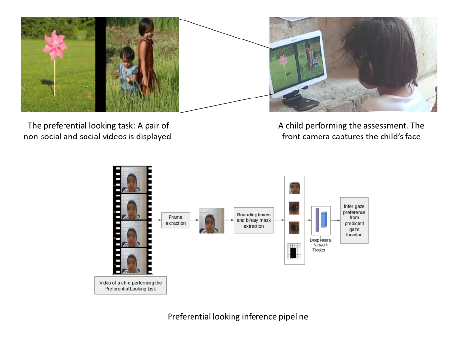

## About ##
Preferential looking tasks routinely deploy gaze tracking for social motivation assessments. Here a user is presented with pairs of adjacent social and non-social images or videos on a screen. The aim is to understand the user's preference for social vs non-social videos. Typically such tasks are carried out in restricted or lab settings with a complicated hardware/software setup which require expert handling and user specific calibration. 

With this approach we aim to build an assessment technique which removes dependence of such tasks on cumbersome setup. Unlike other approaches for gaze tracking commonly used in such tasks, our approach doesnt require user specific calibration. It is also not dependent on complicated hardware or software, typically utilized by specialized eye trackers in such settings, thus allowing anyone to perform this task at their home on **Android** tablet devices. 

  The algorithm expects front camera video grab of the subject performing a preferential looking task. The video can be captured on any mobile device in home settings which simultaneously displays the assessment videos or images to the subject. This is an offline end-to-end approach which estimates the screen region the user's gaze is directed at based on the subject's video grab captured by the front camera of the mobile device. Our algorithm utilizes state of the art deep neural network [iTracker](https://github.com/CSAILVision/GazeCapture) which has been retrained for our purpose. We have shared the retrained model.  

We have also validated our algorithm on a set of children performing preferential looking task conducted on tablet devices. We have observed significant boost in accuracy with a modification (clustering) to the post processing step of our algorithm. 

## Processing steps ##
1. INPUT - Videos named child_\<numeric id\>_looking.mp4 to be placed in data/videos/
2. PROCESSING - Run the 'main.py' python file in the code folder. If you wish to generate clusering based output please run kmeans.py after this step
3. OUTPUT - output_file.csv for each subject is placed in data/input/numeric id/. Summary file summary.csv for all videos is located at the parent directory level. output_with_clustering.csv is generated if kmeans.py is executed

    The individual extracted frames, face and eye crops and metadata .mat file containing binary grid information are also placed in the input folder. (A flag for skipping frame extraction is provided in the 'main' file in case frame extraction is not required. The face and eye crop extraction will be skipped in case metadata file is already present in this folder)

## Contents ##
1. Source code folder (code)
2. Retrained iTracker model (checkpoint.pth.tar)
3. WIP folder (utilized during processing. contents deleted after execution)
4. data folder:

    4.1 input (extracted frames and metadata saved here)

    4.2 videos (the input videos are to be provided here)

#### NOTE ####
There are dummy files in data/input, data/videos and WIP folders. Please remove these files before execution.

## Requirements ##
1. Refer conda_setup.yml
2. ffmpeg for ubuntu

## Licenses ##
    Please refer to License files in respective folders ('code' and 'csail')
